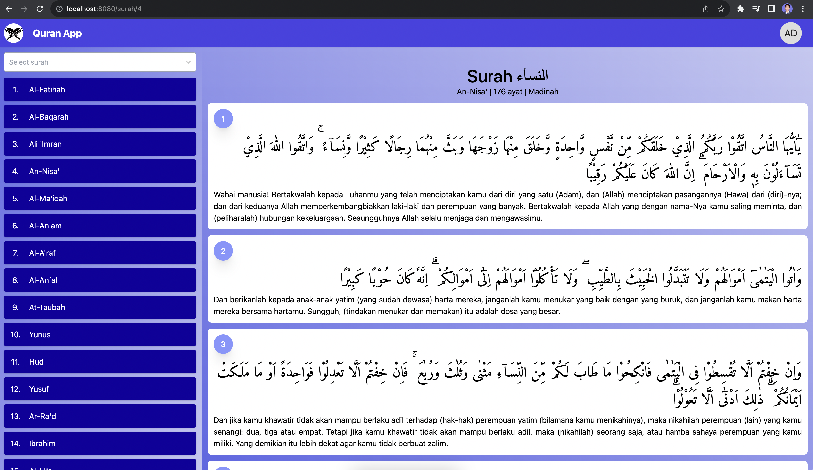

# Qur'an App

Source code FE using React+Vite, tailwindCSS, radix-UI, etc. Using a routing based on file/folder names.

## Installation

- Clone repository
- Run `npm install`
- Run `npm run dev`
- Open `localhost:8080` in browser

## Development

- Run `npm run dev`
- Open `localhost:8080` in browser
- Recommend use Vs Code for code editor, then setup extension prettier & extentension for tailwindcss (`https://tailwindcss.com/docs/editor-setup#intelli-sense-for-vs-code`)

## Testing

- Run `npm run test`
- Run `npm run test:cover`
- See other command in package.jsom
- Open file from directory `./coverage/lcov-report/index.html` in browser

## Production Build

- Run `npm run build`
- Run `npm run preview`
- Open `localhost:8080` in browser

## Authentication and Demo

- Use username admin and password admin for login

## Commit

- Use conventional commit for commit message. See [conventional commits](https://www.conventionalcommits.org/en/v1.0.0/).
- use english for commit message

## Team Work Flow

  

## Reference

- [Generouted](https://github.com/oedotme/generouted)
- [TailwindCSS](https://tailwindcss.com/)
